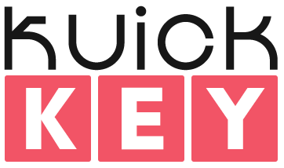
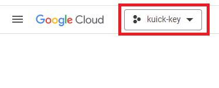
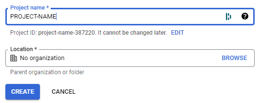
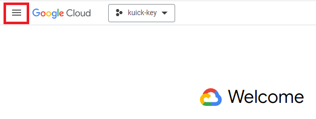
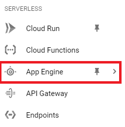
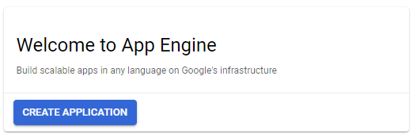
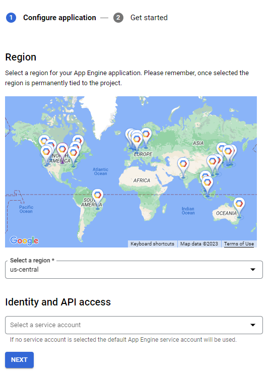
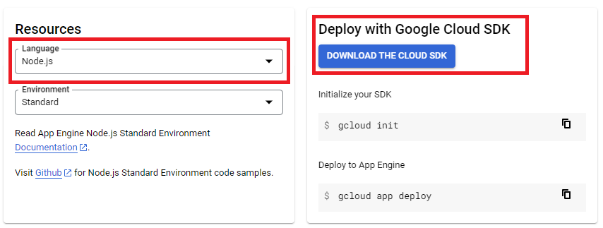
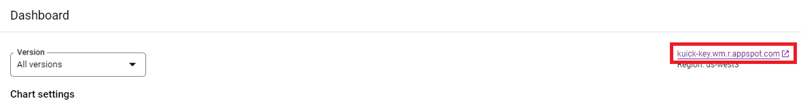

### Web App designed by [Zachary Rowley](https://www.portfolio2000.ca)

<br />

# Getting Started

You can navigate to [Kuick Key](kuick-key.ca) to play the currently deployed Kuick Key.

*Note: This game is only playable on desktop.*


### To start playing, you must enter a username.


*Note: This name will be seen by others during a game.*

**DO NOT use personal information.**

You will automatically enter into a game session and be put into a queue!

Now wait till its our turn or your opponent is ready!

<br />


# How to Play

## Gameplay

The **goal** is simple, 

When the game starts letters will drop down into a box on your side of the screen. Press the key associated with the button currently inside the box to gain **one** point.

If you press the incorrect key you will gain a **strike**. 


If you get **three** strikes you **lose the game**.


Try to press more keys than your opponent before the time is up to **win**!

## Leaderboard

After completing a game, your score is compared to the current top **five** scores. If your score is **greater** than the any of the enties on the leaderboard, your **username** and **score** is recorded for all to see!

<br />

# How to Deploy

## 1. Create a new Google Cloud Project

Log into your google account and navigate to [Google Cloud](https://cloud.google.com).

If you are not already in the dashboard, press the **Go to console** button.

You can now create a new project by clicking the New Project Button located on the top right of your Google Cloud window.




<br />

## 2. Initialize a new Application Engine

Next you will want to navigate to the [App Engine](https://console.cloud.google.com/appengine/start) item in from your **Google Cloud bashboard**. You can find this item by clicking on the **hamburger** icon on the **top right** of your Google Cloud window



This will open a pop out pannel. Click the **More Products** button and scroll down to the **Serverless**.



Now that you are in the app engine sub menu, you can create a new app engine.

Click the **create application** button to start the multi-step process of creating an application.



Step one is to set up the **region** and **service account** if you have a service account. Picking a location that is **close** to your current location is **advised**.




Step two is to select the **language** the application will use and to download the **cloud SDK**. For the language you will want to pick **Node.js**.

You also will need to download and install the **Google Cloud SDK** from the link on the same page. 

Install the CLI with all **default options**. This download might take some time, this is **normal**.

*Note: The specific download will depend on your operating system.*



Once the CLI finishes installing, **make sure to allow the Google Cloud CLI to run.**. The CLI will run a command that will ask for user input. Type **"Y"** when prompted. This will open a google oauth to confirm your google account. 

After authenticating, the CLI will prompt you to choose which project to use. **Select the project created earlier.** 

And done! Your google cloud app engine is set up and its time to grab the program to host.

<br />

## 3. Clone & Configure the Kuick Key Program

Clone the newest release of the program from [Github](https://github.com/SabishiiMe/kuick-key.git)

Now open your web development IDE of your choice and navigate to the cloned project directory.

Open the .env in each of the cloned folders and fill in the values for CLIENTURL and REACT_APP_SERVERURL with each **app engines deployed address**.




Finally you can run the following commands inside the cloned directory:

```
npm install

gcloud init

gcloud app deploy
```

*Gcloud Init may prompt you to enter in your account info, create a new configuration, and set the cloned software to the Google Cloud Project you created.*

*Deploying the application may take some time.*


## 3. Toubleshooting

If when performing API calls you get a ```Could not load the default credentials``` error, open the **Google CLI**, navigate to the server directory on your computer, and run the follow command:
``` 
gloud auth application-default login
``` 

You may also have to create a **firewall port** for the **server** app engine to allow access to port **65080**. This can be done by going to **networking** > **VPC network** > **firewall** and selecting **Create Firewall Rule** 

## Tech Stack

**Client:** [React](https://react.dev), [React Router](https://reactrouter.com/en/main), [Chakra UI](https://chakra-ui.com), 

**Server:** [Node js](https://nodejs.org/en), [Google Cloud](https://cloud.google.com)