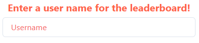

### Web App designed by Zachary Rowley

### Developed using [React](https://react.dev) and [Chakra](https://chakra-ui.com) UI

<br />

# Getting Started

You can navigate to [Kuick Key](kuick-key.ca) to play the currently deployed Kuick Key.__ 
*Note: This game is only playable on desktop.*

<br />

### To start playing, you must enter a username.


*Note: This name will be seen by others during a game.*

**DO NOT use personal information.**

You will automatically enter into a game session and be put into a queue!

Now wait till its our turn or your opponent is ready!

# How to Play

## Gameplay

The **goal** is simple, 

When the game starts letters will drop down into a box on your side of the screen. Press the key associated with the button currently inside the box to gain **one** point.

If you press the incorrect key you will gain a **strike**. If you get **three** strikes you **lose the game**.

Try to press more keys than your opponent before the time is up to **win**!

## Leaderboard

After completing a game, your score is compared to the current top **five** scores. If your score is **greater** than the any of the enties on the leaderboard, your **username** and **score** is recorded for all to see!

# How to Deploy

## 1. Create & Initialize a new Google Cloud Project

Log into your google account and navigate to [Google Cloud](https://cloud.google.com).

If you are not already in the dashboard, press the **Go to console** button.

You can now create a new project by clicking the New Project Button located on the top right of your Google Cloud window.


Now we can clone the newest release of the program from [Github](https://github.com/SabishiiMe/kuick-key.git)

Now open your web development IDE of your choice and navigate to the cloned project directory.

Finally we can run the following commands inside the cloned directory:
```
npm install

gcloud init
```

*Gcloud Init will prompt you to enter in your account info, create a new configuration, and set the cloned software to the Google Cloud Project you created.*
